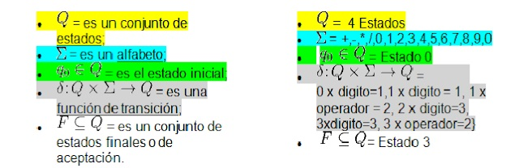
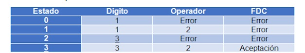

## Python Program Finite Automaton

  <li>Dentro de los usos que se le pueden dar a las máquinas de estados, y en particular a los AFD, está el reconocimiento de cadenas. Para realizar este reconocimiento en forma precisa y automatizada, el mismo puede implementarse en cualquier lenguaje de programación.
 </li>
  <li>Será posible que habiendo diseñado un autómata que sea capaz de reconocer un conjunto de cadenas de un lenguaje, construir un programa que implemente dicho autómata en algún lenguaje de programación, a tal fin el Algoritmo de funcionamiento del programa puede ser obtenido a partir del AFD en forma directa. 
  </li>
  

Te evalua expresiones como 1+2 
La matriz de reglas es:
<li>_________________________________________</li>
<li>|Estado|Digitos|Operadores|Fin de cadena|</li>
<li>|______|_______|__________|_____________|</li>
<li>|q0    |q1     |Error     |Error        |</li>
<li>|q1    |Error  |q2        |Error        |</li>
<li>|q2    |qf     |Error     |Error        |</li>
<li>|q0    |Error  |Error     |Aceptacion   |</li>
<li>|______|_______|__________|?____________|</li>
 
</ol>
En este ejemplo validaremos una expresión aritmética ejemplo 12+3 o tal vez 23*3/5-8+1, sea cual sea la expresión nuestro autómata será capaz de decidir si es o no una expresión aritmética, para ello hay que crear todo desde cero.

### Paso 1: Es crear nuestro autómata. Para este ejemplo propongo lo siguiente:


Dígito = { + , - , / , * }         Operador = { 0 , 1 , 2  , 3 , 4 , 5 , 6 , 7 , 8 , 9 }

### Paso 2: Formalmente se define como una tupla (Q, Σ, q0, δ, F) donde:



### Paso 3: Ahora podemos construir nuestra tabla de transiciones:



<p></p>

## Source Code

```python

def caracter(character):
    global simbolo
    simbolo=""
    global Fin
    Fin=""
    digito="[0-9]"
    operador="(\+|\-|\*|\/)"
    
    #comparamos si es digito o operador
    if(re.match(digito,character)):
        simbolo=" Digito "
        return 0
    else:
        if(re.match(operador,character)):
            simbolo="Operador"
            return 1
        else:
            if(character==Fin):
                return 2
        
        #si no es ni un digito ni un operador entonces es un caracter no validp
        print("Error el caracter:",character,"no es valido")
        exit()
#%%
#Este es la tabla de transiciones del automata AFD creado
tabla=[[1,"E","E"],["E",2,"E"],[3,"E","E"],["E","E","A"]]
estado = 0
for  character in cadena:
    estadosig=estado
    
    #llamamos al metodo para saber si es un caracter valido y el valor retornado se guarda en charcaracter
    character= caracter(character)
    
    #guardamos en estado el valor obtenido en la tabla segun las cordenadas que recibio anteriormente
    estado=tabla[estado][character]

```
## Help - ?


Visit <a href="https://github.com/upslp-teoriacomputacional/180864/" target="\_blank"> (Programming in Python).

<small>@jc-gi<a href="https://github.com/jc-gi" target="\_blank"></a> for the language support! </small>

## Contributing
Pull requests are welcome. For major changes, please open an issue first to discuss what you would like to change.

Please make sure to update tests as appropriate.

## License
[MIT](https://choosealicense.com/licenses/mit/)
